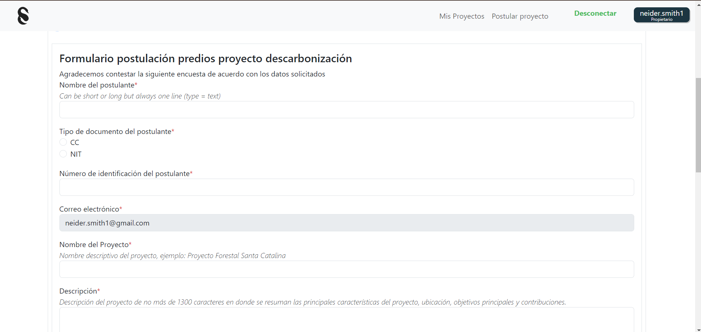

# 📊 Dashboard

En el encontrarás tu historial de transacciones, tus proyectos comprados y la estimación de ganancia por cada uno, tambien podrás saber el periodo en el que se encuentra cada uno de ellos

1. **Datos Generales de tus inversiones**\
   Encontrarás 3 datos a cerca de tu inversión, ganancia estimada y total de tokens comprados así como un grafico de como se distribuyen tu cantidad de tokens en los diferentes proyectos

<figure><figcaption></figcaption></figure>

2.  **Datos Especificos de cada proyecto**\
    Podrás seleccionar el proyecto que desees ver y encontrarás datos importantes como el periodo en el cual se encuentra y sus fechas, precio actual, cantidad de tokens comprados y el detalle de los valores en los que fueron comprados, tambien la ganancia estimada entre otros datos, tambien encontrarás graficas de barras acerca del precio del token y el volumen y su tendencia por periodo\

    <figure><figcaption></figcaption></figure>
3.  **Lista de Transacciones Realizadas**\
    Si necesitas el detalle de tus transacciones fechas y hash de confirmación podrás consultarlo aquí\

    <figure><figcaption></figcaption></figure>
